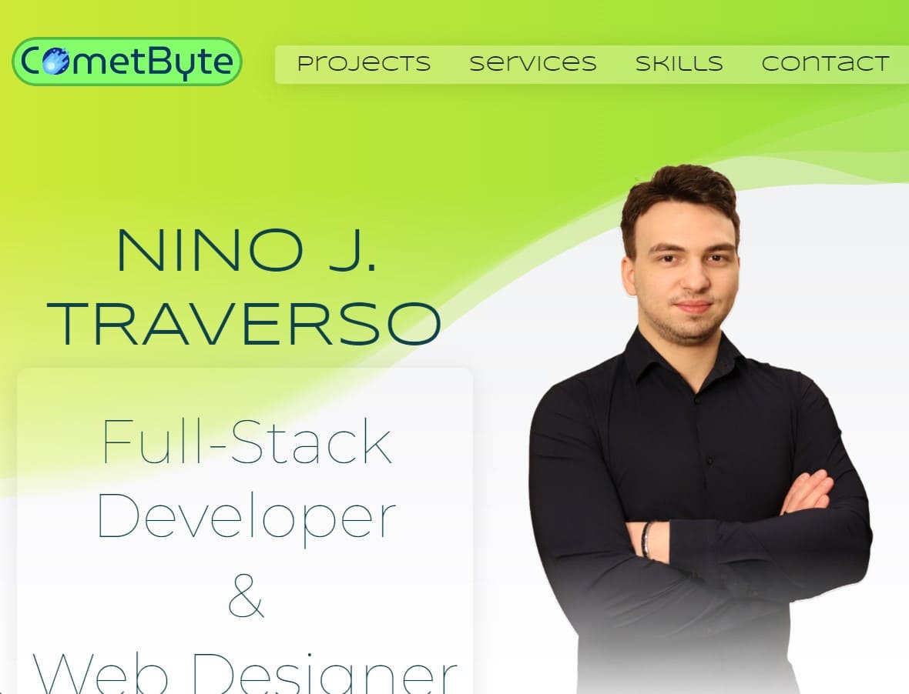

<h1 align="left">CometByte</h1>

###

This is my personal portfolio project built using React. It showcases my projects, skills, and services.

  

###

<h2 align="left">Skills</h2>

###

  
  
  
  
  
  
  
  
  
  
  
  
  
  
  
  
  
  
  

###

<h2 align="left">About me</h2>

###

I became a full-stack developer because I love bringing to life ideas and creating innovative web solutions while tackling new challenges daily. I like working on different projects and topics; not only it aids my development skills but also allows me to learn new things in different fields.

###

<h2 align="left">Acknowledgements</h2>

###

  

###

© 2024 - CometByte

###
